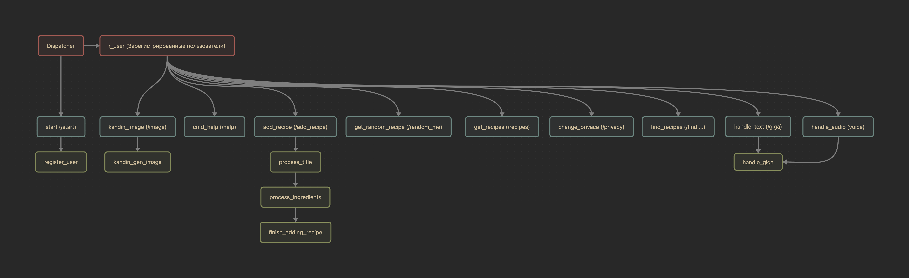

# Описание
Бот для поваров, который позволит хранить рецепты, искать новые и советоваться с БЯМ
Функционал:
- Регистрация пользователя (с Middleware / БД - SQLite)
- Сохранение рецептов готовки (БД - SQLite) 
- Получение существующих рецептов
- Получение случайного рецепта из своих
- Получение случайного рецепта из рецептов всех пользователей
- Настройка приватности (Показывать ли свои рецепты другим)
- БЯМ с индивидуальным диалогом со встроенным "кулинарным промптом"
- Возможность использования Kandinsky
- Поиск рецептов по векторной базе существующих
- Мотивирующие напоминания о правильном питании (Apsheduler)

# Исполнители
Синицын Роман Кириллович

# Блок-схема

# Скрины работы
